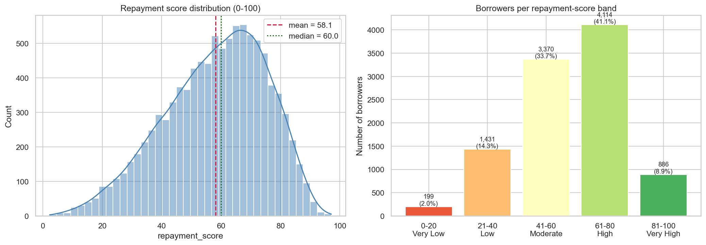
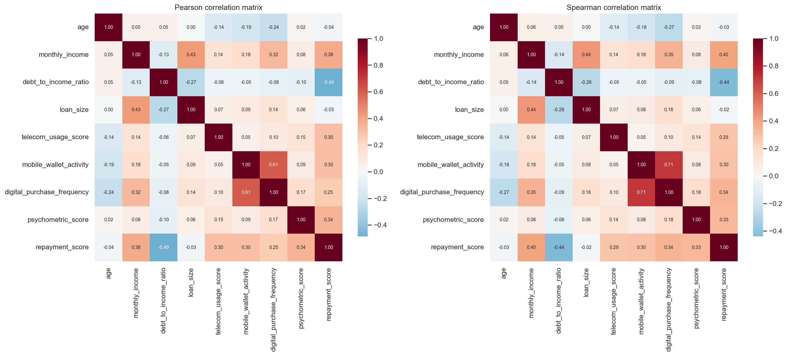
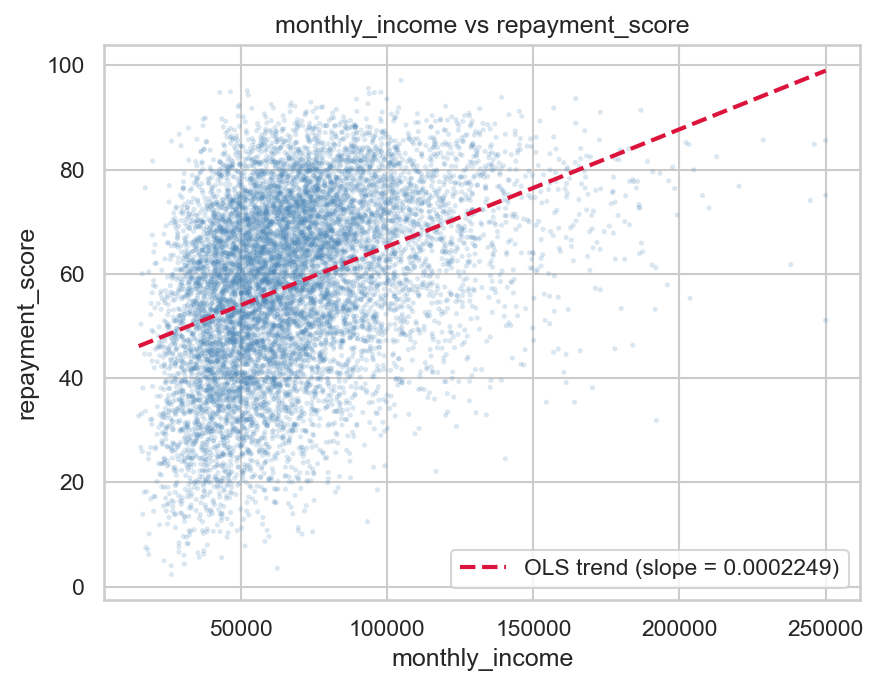
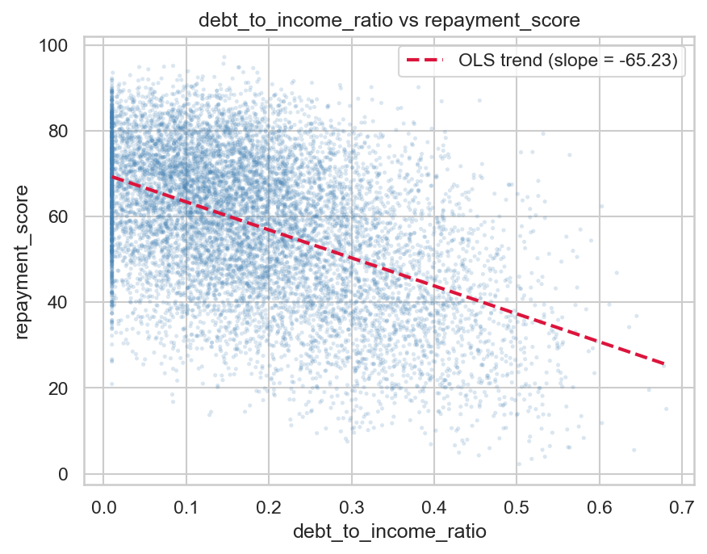
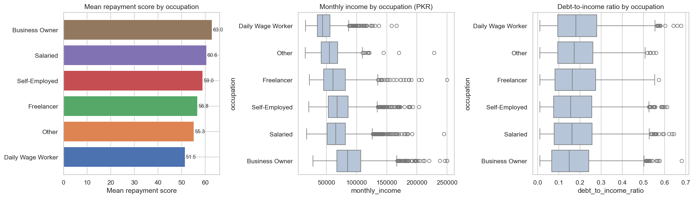
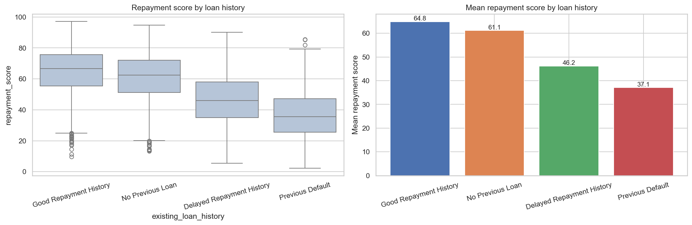
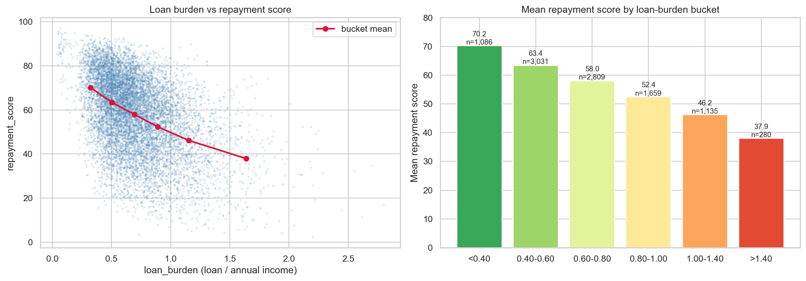

# EDA Report — Synthetic Credit Scoring Dataset (Pakistan)

**Dataset:** `data/synthetic_credit_scoring_dataset.csv` · 10,000 borrowers × 15 columns
**Companion notebook:** `EDA_Credit_Scoring.ipynb` (fully executed, zero errors)
**Figures:** `EDA_Figures/` (8 saved PNGs)
**Scope:** Pre-modeling exploration only — no ML training, no train/test split, no modification of the original CSV. All numbers below come from the actual dataset.

The dataset replicates the calibration of Khan, Tariq & Khattak (2025), *"AI-Enhanced Credit Scoring Using Alternative Data for Financial Inclusion in Pakistan"* (Table 4.1), with a **continuous `repayment_score` target (0–100)** instead of the paper's binary default flag.

---

## 1. Dataset Overview

| Role | Columns |
|---|---|
| ID | `borrower_id` |
| Predictors (10) | `age`, `occupation`, `monthly_income`, `existing_loan_history`, `debt_to_income_ratio`, `loan_size` *(moderating variable)*, `telecom_usage_score`, `mobile_wallet_activity`, `digital_purchase_frequency`, `psychometric_score` |
| Target | `repayment_score` (continuous, 0–100) |
| Demographics (fairness audit only) | `gender`, `province` |
| Encoding helper | `loan_history_code` — numeric encoding of `existing_loan_history` (not an independent feature) |

## 2. Data Quality Results

- **Missing values:** 0 (all columns)
- **Duplicate rows:** 0 (including and excluding `borrower_id`); **duplicate borrower IDs:** 0
- **Datatypes:** all valid (numeric where expected, string for categoricals)
- **Range constraints — 8/8 PASS:**

| Constraint | Observed min / max | Result |
|---|---|---|
| Age 18–65 | 18 / 65 | PASS |
| Income 15,000–250,000 PKR | 15,000 / 250,000 | PASS |
| Loan size 50,000–1,200,000 PKR | 50,296 / 1,200,000 | PASS |
| DTI 0–1 | 0.010 / 0.681 | PASS |
| Telecom score 0.20–0.98 | 0.200 / 0.980 | PASS |
| Wallet activity 0.10–0.95 | 0.100 / 0.950 | PASS |
| Psychometric 0–100 | 3.1 / 97.0 | PASS |
| Repayment score 0–100 | 2.27 / 97.15 | PASS |

- `loan_history_code` ↔ `existing_loan_history` crosstab is a **perfect 1:1 diagonal** (0 = No Previous Loan, 1 = Good, 2 = Delayed, 3 = Default).

## 3. Descriptive Statistics

| Variable | Mean | Median | Std | Min | Q1 | Q3 | Max | Skew |
|---|---|---|---|---|---|---|---|---|
| age | 37.67 | 38 | 9.31 | 18 | 31 | 44 | 65 | +0.10 |
| monthly_income (PKR) | 68,380 | 63,322 | 29,202 | 15,000 | 47,337 | 83,138 | 250,000 | +1.21 |
| debt_to_income_ratio | 0.181 | 0.162 | 0.127 | 0.010 | 0.080 | 0.261 | 0.681 | +0.67 |
| loan_size (PKR) | 519,629 | 494,989 | 180,317 | 50,296 | 391,541 | 618,462 | 1,200,000 | +0.83 |
| telecom_usage_score | 0.610 | 0.615 | 0.140 | 0.200 | 0.515 | 0.711 | 0.980 | −0.18 |
| mobile_wallet_activity | 0.530 | 0.535 | 0.189 | 0.100 | 0.391 | 0.670 | 0.950 | −0.08 |
| digital_purchase_frequency | 5.26 | 3 | 7.67 | 0 | 1 | 6 | 45 | +2.83 |
| psychometric_score | 58.05 | 58.0 | 15.53 | 3.1 | 47.5 | 68.6 | 97.0 | −0.03 |
| repayment_score | 58.13 | 60.01 | 17.12 | 2.27 | 46.56 | 71.19 | 97.15 | −0.43 |

Highlights: income is highly variable (CV ≈ 0.43) and right-skewed; DTI is generally low (75% ≤ 0.26); loan sizes span a 24× range; purchase counts are strongly right-skewed count data.

## 4. Target Analysis

`repayment_score` — mean **58.13**, median **60.01**, std **17.12**, skew **−0.43**; p05 = 27.07, p25 = 46.56, p75 = 71.19, p95 = 83.14. Unimodal, centered on moderate-good, thin extremes, no boundary pile-ups.

| Band | Count | Share |
|---|---|---|
| 0–20 Very Low | 199 | 2.0% |
| 21–40 Low | 1,431 | 14.3% |
| 41–60 Moderate | 3,370 | 33.7% |
| 61–80 High | 4,114 | 41.1% |
| 81–100 Very High | 886 | 8.9% |

The target stays **continuous** — this is a regression/scoring problem; no binarization.

## 5. Correlation Findings (predictors vs target)

| Predictor | Pearson r | Spearman ρ |
|---|---|---|
| debt_to_income_ratio | **−0.486** | −0.440 |
| monthly_income | **+0.384** | +0.404 |
| psychometric_score | +0.341 | +0.334 |
| telecom_usage_score | +0.300 | +0.290 |
| mobile_wallet_activity | +0.300 | +0.297 |
| digital_purchase_frequency | +0.254 | **+0.338** (nonlinear) |
| loan_size | −0.035 | −0.020 |
| age | −0.036 | −0.030 |

Every alternative-data signal (telecom, wallet, purchases, psychometrics) carries moderate positive association — supporting the premise that digital footprints substitute for missing credit history. Loan size shows almost no *direct* marginal relationship — its effect is conditional on income (see §8).

Matrix highlights: wallet ↔ purchases **+0.611** (ρ = +0.706, main multicollinearity candidate); income ↔ loan size +0.430; income ↔ purchases +0.324; loan ↔ DTI −0.270; income ↔ DTI −0.132 (weak). No pair exceeds |r| = 0.7.

## 6. Feature Relationships

- **Income → Loan size (+0.430):** larger incomes request larger loans, with wide spread (not mechanical).
- **Income → DTI (−0.132, weak):** DTI is driven by loan-history category (mean DTI 0.10 for No Previous Loan vs 0.41 for Previous Default), not by income.
- **Wallet → Purchases (+0.611 / ρ +0.706):** strongest feature-feature link — wallet intensity drives digital spending.
- **Loan size → DTI (−0.270):** more-indebted borrowers qualify for smaller loans.

## 7. Occupation & Loan History Analysis

**Occupation** (association, no causality): mean repayment score spans ~11.5 points — Business Owner **62.96** (mean income 90,246) > Salaried 60.56 > Self-Employed 59.01 > Freelancer 56.79 > Other 55.27 > Daily Wage Worker **51.46** (mean income 46,811). The ordering tracks income almost perfectly while mean DTI is flat (0.17–0.20) → the occupation effect operates via income capacity, not debt.

**Loan history** (strongest categorical relationship): Good **64.85** > No Previous Loan **61.13** > Delayed **46.17** > Previous Default **37.07** — a ~28-point span. "No Previous Loan" scores between Good and Delayed (absence of history is neutral, not penalized). Impaired histories also carry much higher DTI (0.31 / 0.41 vs 0.10 / 0.18). Nearly half the population (46.9%) has no prior loan — the credit-invisible segment this project targets.

## 8. Loan Burden & Moderation Findings

Derived variable (EDA-only): `loan_burden = loan_size / (12 × monthly_income)` — mean **0.706**, median 0.653, range 0.038–2.80, skew +1.21.

**Burden is the strongest single associate of the target: r = −0.453** (vs income +0.384, loan size −0.035). It correlates −0.578 with income and +0.361 with loan size, synthesizing both into one affordability signal.

| Burden bucket | n | Mean score |
|---|---|---|
| < 0.40 | 1,086 | **70.16** |
| 0.40–0.60 | 3,031 | 63.40 |
| 0.60–0.80 | 2,809 | 58.01 |
| 0.80–1.00 | 1,659 | 52.42 |
| 1.00–1.40 | 1,135 | 46.18 |
| > 1.40 | 280 | **37.93** |

**Moderation evidence (loan size as moderating variable):**

- Pooled income↔score correlation is **+0.384**, but **within burden terciles** it drops to +0.201 (Low) / +0.207 (Moderate) / +0.260 (High) — over half the raw association flows through the burden channel.
- Mean score falls across terciles: 66.09 → 59.10 → 49.20.
- The score gap between upper- and lower-income halves widens from **0.7 points** (burden < 0.40) to **4–6 points** (moderate/high burden) — at minimal burden, income barely differentiates scores.
- Interpretation: moderation manifests as **level (intercept) shifts plus attenuation of the pooled income effect**, not as slope reversal. A large loan relative to income drags the score down for everyone and masks much of the income advantage. Observed interaction pattern; no causal claim.

**Nonlinear relationships:** age shows a mild inverted-U peaking at 30–35 then declining to 49.9 (60–65) despite near-zero linear correlation; digital purchases show a positive **concave** relationship (climbs 49.7 → ~64 by 7–10 purchases, then flattens — ρ 0.338 > r 0.254); raw loan size is marginally flat (decile means 56.7–59.0); loan burden declines near-linearly.

## 9. Outlier Analysis (IQR fences — no removals)

| Variable | Below | Above | Total | Share |
|---|---|---|---|---|
| monthly_income | 0 | 274 | 274 | 2.74% |
| loan_size | 1 | 251 | 252 | 2.52% |
| debt_to_income_ratio | 0 | 72 | 72 | 0.72% |
| digital_purchase_frequency | 0 | 1,030 | 1,030 | 10.30% |
| repayment_score | 26 | 0 | 26 | 0.26% |

All flagged values lie within valid ranges; the high purchase-count share is expected for right-skewed count data under a symmetry-based rule. **All retained** — extreme-but-valid observations represent legitimate high-income / high-risk borrowers.

## 10. Fairness Exploration (baseline audit)

- **Gender:** Female mean 57.64 (median 58.98) vs Male 58.44 (median 60.60) — gap **0.80 points ≈ 0.05 SD**.
- **Province:** means span 57.93 (Balochistan) – 58.25 (Sindh) — range **0.32 points**.

Both negligible, consistent with demographics being generated independently of predictors and target. This is the fairness **baseline**: any group disparity appearing after model training would be attributable to the modeling pipeline, not the data. No discrimination is inferred from synthetic data.

## 11. Key Conclusions

1. The dataset is **clean** (0 missing / 0 duplicates / 8/8 constraints PASS) and **statistically coherent** — distributions, ranges and relationships match the intended generation logic calibrated to the paper.
2. It is **suitable for continuous repayment-score prediction**: unimodal 0–100 target with realistic spread and no boundary artifacts.
3. Meaningful predictor signal exists across **traditional** (DTI −0.49, income +0.38) and **alternative** (psych +0.34, telecom +0.30, wallet +0.30, purchases +0.25) blocks, plus strong categorical signal (loan history ~28-pt span).
4. The intended **loan-size moderation pattern is empirically present** via loan burden (r = −0.45; pooled income effect halves within burden groups; level shifts of 17+ points).
5. No data-quality problems block model training; no outlier removal or imputation is required.

## 12. Recommendations for ML Preprocessing

- **Predictors (10):** age, occupation, monthly_income, existing_loan_history, debt_to_income_ratio, loan_size, telecom_usage_score, mobile_wallet_activity, digital_purchase_frequency, psychometric_score.
- **Target:** repayment_score (continuous). **Drop:** borrower_id, loan_history_code (duplicate encoding — never use both forms), gender, province (retain separately for fairness experiments only).
- **Encoding:** one-hot for `occupation` (6 levels) and `existing_loan_history` (4 levels; or a deliberate ordinal risk mapping).
- **Engineered features:** `loan_burden` (strongest associate, −0.453) and optionally burden×DTI / burden×history interactions for linear models; log-transforms of income, loan size and purchase counts for the linear baseline (trees don't need them).
- **Collinearity caution:** wallet ↔ purchases (+0.61/ρ +0.71) in linear models.
- **Protocol:** 80/20 split + 5-fold CV on the training set; metrics MAE, RMSE, R², predicted-vs-actual correlation — mirroring Khan et al. (2025) adapted to the continuous target.
