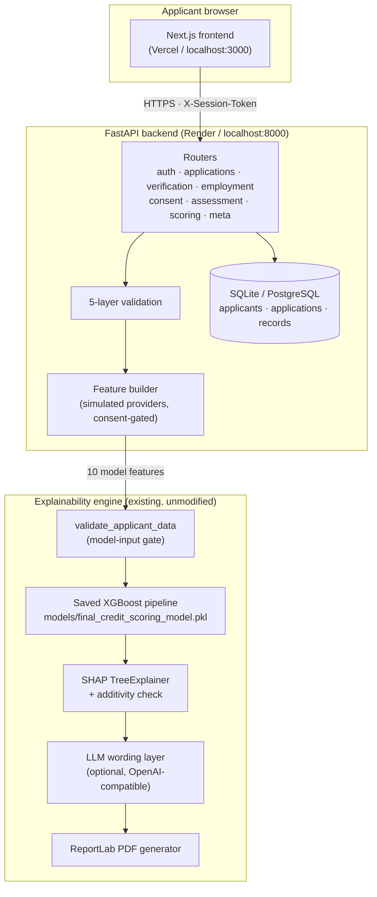
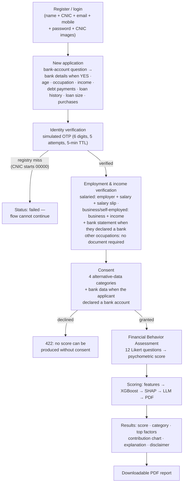
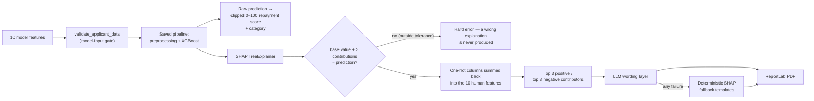
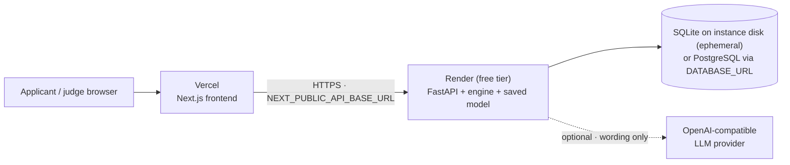

# AI-Based Alternative Credit Scoring System

An explainable, consent-first credit assessment prototype for Pakistan's
credit-invisible population — shopkeepers, daily-wage workers and freelancers
who use Easypaisa/JazzCash but have no bank account, no collateral and no
formal credit history.

> **The demo in one sentence:** a financially underserved applicant provides
> consented alternative information, completes a financial-behaviour
> assessment, receives an AI-generated repayment score, understands exactly
> which factors influenced that score, and downloads a transparent assessment
> report.

**Stack:** XGBoost + SHAP + LLM wording layer + ReportLab (existing engine,
untouched) · FastAPI + SQLAlchemy backend · Next.js (App Router) + Tailwind
frontend · 148 backend tests + 64 explainability checks, all green ·
deployment config for Render + Vercel ([DEPLOYMENT.md](DEPLOYMENT.md)).

---

## 1. Project Overview

The system does **not** produce a binary loan decision. It produces a
**repayment score from 0 to 100**:

> The system generates a model-estimated repayment score from 0–100. A higher
> score indicates a stronger model-assessed repayment profile. **The score is
> not a calibrated probability of repayment and not a loan approval decision.**
> Loan decisions remain with the lending institution.

Every score is accompanied by:

- the **category** (Very Low / Low / Moderate / High / Very High),
- the **top factors** that raised and lowered it (real SHAP contributions),
- a **human-readable explanation**, and
- the **disclaimer** above — in the UI, in the API response and in the PDF.

The ML/explainability engine (`explainability/`, saved pipeline in `models/`)
was built and validated first and was **not modified** while the product was
built around it. The model is loaded and used as-is; it is never retrained or
re-saved.

## 2. Problem Statement

Millions of Pakistanis are credit-invisible: no bank account, no salary slip,
no credit bureau record. A traditional lender cannot score them, so a
shopkeeper who wants to expand inventory, or a daily-wage worker who needs to
bridge a gap before payday, is left with informal lenders at punishing rates.

The question this project answers: **can alternative data the applicant
already generates — telecom usage, mobile-wallet activity, digital purchase
patterns, plus a self-assessed financial-behaviour profile — support a fair,
explainable repayment assessment?**

## 3. Why Alternative Credit Scoring

- **Financial inclusion** — designed for applicants who may lack traditional
  banking history; the inputs are things they already have (a SIM, a wallet,
  declared income).
- **Explainability** — a score must be accompanied by understandable factors.
  SHAP gives every applicant the *actual* arithmetic behind their score, not a
  generic reason code.
- **Consent-first privacy** — alternative data is only fetched when the
  applicant explicitly consents to each category; scoring is impossible
  without it.
- **Responsible AI** — the model produces an assessment, never a decision;
  nothing is presented as a guarantee.

## 4. Current Prototype Limitations

Stated honestly, because the spec requires it:

- **Synthetic training data.** The model (test R² 0.7171) was trained on a
  synthetic dataset replicating a research article's feature set. The score
  is a *model-estimated assessment*, not a calibrated probability.
- **All integrations are clearly-labelled mocks.** Identity verification,
  OTP delivery, telecom and wallet feature providers are simulated. No real
  NADRA, Easypaisa, JazzCash or telecom system is contacted.
- **The Financial Behavior Assessment is a prototype instrument**, not a
  scientifically validated psychometric test.
- **Lightweight session auth** (register with name + CNIC + mobile → session
  token). Appropriate for a demo; a production system needs real
  authentication.
- **Demo database is ephemeral** on free-tier hosting (see
  [DEPLOYMENT.md](DEPLOYMENT.md) for the PostgreSQL option).
- Fairness would need to be evaluated on representative real data, and
  regulatory/governance requirements addressed, before any real deployment.

## 5. Feature Set

The ten model features and where each one comes from (also served live at
`GET /api/meta/feature-sources`):

| # | Feature | Source in this prototype | Scale |
|---|---------|--------------------------|-------|
| 1 | Monthly Income | Applicant declaration | PKR 1,000–5,000,000 |
| 2 | Age | Identity information | 18–65 |
| 3 | Occupation | Applicant declaration | Salaried / Self-Employed / Business Owner / Freelancer / Daily Wage Worker / Other |
| 4 | Existing Loan History | Applicant declaration | No Previous Loan / Good Repayment History / Delayed Repayment History / Previous Default |
| 5 | Debt-to-Income Ratio | **Derived**: monthly debt payments ÷ income | 0–1 |
| 6 | Telecom Usage Score | Simulated telecom summary (mock) | 0–1 |
| 7 | Mobile Wallet Activity | Simulated wallet summary (mock) | 0–1 |
| 8 | Digital Purchase Frequency | Applicant declaration | 0–200 / month |
| 9 | Psychometric Score | Financial Behavior Assessment (12 questions) | 0–100 |
| 10 | Loan Size | Requested loan amount | PKR 10,000–10,000,000 |

Simulated provider composites (telecom: recharge consistency 30%, account
type 20%, SIM tenure 25%, average recharge 25%; wallet: transaction frequency
30%, average balance 25%, inflow/outflow 25%, account age 20%) are documented
formulas, deterministic per applicant, and gated on consent.

## 6. System Architecture



Repository layout:

```text
backend/            FastAPI service (routers, validation, scoring, persistence)
explainability/     ML engine: validation, scoring + SHAP, LLM wording, PDF
models/             Saved pipeline + artifacts (NEVER retrained or re-saved)
frontend/           Next.js applicant UI
data/               Synthetic training dataset
app.py, reality_check.py   Streamlit live demo (secondary)
DEPLOYMENT.md       Render + Vercel deployment guide
memory.md           ML prototype development documentation
```

## 7. End-to-End Data Flow

An application walks a strict, server-enforced step order —
`created → verified → consented → assessed → scored` — and no step can be
skipped, repeated or done out of order. The Phase 3 employment/document
verification runs as a sub-step while the application is `verified` and
must be completed before consent can be granted.



Validation is layered (each layer rejects with a specific, structured error):

1. **Request shape** — pydantic DTOs (types, formats).
2. **Identity formats** — CNIC `XXXXX-XXXXXXX-X`, Pakistani mobile `03XXXXXXXXX`.
3. **Feature ranges** — the exact NUMERIC_RANGES/valid categories the training
   data defined (shared with the engine, single source of truth).
4. **Cross-field checks** — debt > income rejected; consistency checks
   (e.g. income vs loan size) produce *warnings only*, never rejections and
   never score changes.
5. **Model-input gate** — `validate_applicant_data` re-validates the exact
   feature vector before it reaches the pipeline.

## 8. Financial Behavior Assessment

A 12-question, 5-point Likert self-assessment across four dimensions
(Financial Discipline, Repayment Responsibility, Spending Control, Financial
Planning), with balanced positive and negative wording; six items are
reverse-scored (answer 1..5 → oriented 5..1).

The oriented total (12–60) is normalized to the model's psychometric scale:

```text
psychometric_score = (total − 12) / 48 × 100        → 0–100
```

This matches the training distribution (observed 3.1–97.0). Six logically
related question pairs produce **consistency warnings** (e.g. "answers to
questions 1 and 9 point in different directions") — assessment-quality
indicators that are shown to the applicant but **never reject an applicant
and never change the score**. The instrument is documented everywhere it
appears as a *prototype* financial-behaviour assessment, not a validated
psychometric test.

## 9. Validation Architecture

See §7 for the five layers. Additional guarantees:

- Identical input always produces an identical score (the model is
  deterministic and is never retrained).
- Identifiers (CNIC, mobile) are **never** sent to the model — the feature
  vector contains the ten features only.
- Every rejection returns a structured error (`code`, `message`, optional
  field-level `details`) — never a stack trace, never internals.
- Wrong-OTP attempts are rate-limited (5), then the verification fails;
  expiry behaves the same; a fresh OTP always recovers the flow.

## 10. ML Pipeline



- Regression XGBoost (target: continuous 0–100 repayment score), selected
  after comparing multiple models; test **R² 0.7171**.
- The saved pipeline bundles preprocessing + model, so inference applies
  exactly the training transformations.
- The pickle is loaded once and cached; it is **never** re-saved.
- Categorical SHAP columns are summed back to the original feature (SHAP
  values are additive), labelled with the applicant's actual level — so the
  applicant sees "Occupation: Freelancer", never "occupation_Freelancer".

## 11. Explainability

- **SHAP TreeExplainer** produces the true per-feature contribution for each
  individual prediction.
- **Additivity check**: `base value + Σ contributions ≈ prediction`; a
  mismatch raises an error instead of an unreliable explanation.
- The report shows at most the **top 3 factors per side** with their exact
  contributions, plus the full contribution chart.
- Explainability is the bridge between the score and the applicant: a number
  alone is not acceptable output for this system.

## 12. LLM Responsibility

The LLM is a **wording layer only**. It receives the score, the applicant's
feature values and the actual SHAP contributors, and converts them into clear
English. It **never**:

- calculates or modifies the score,
- computes SHAP values or reverses a contribution's direction,
- approves or rejects a loan, or
- invents applicant information.

Safety rails (all enforced and tested):

- A strict system prompt (only supplied information; no causal claims; no
  certainty about repayment; no advice; no SHAP/encoding jargon).
- The response must be **valid JSON** with exactly the expected keys;
  dropped contributors are rejected.
- LLM-derived text is XML-escaped before PDF rendering, and a PDF render
  failure falls back to the deterministic templates rather than blocking
  scoring.
- **Any failure** — missing key, network error, timeout, invalid JSON,
  invalid structure — falls back to predefined templates built from the
  *actual SHAP signs*, so the PDF always renders.
- Identical inputs with the LLM configured produce the stored explanation;
  without it, the deterministic templates. The score is identical either way.

## 13. API Architecture

FastAPI app factory with lifespan DB init; routers per concern; global
exception handlers returning structured errors (`ApiError`, request
validation, and a sanitized catch-all 500 that never leaks internals).

| Method | Path | Purpose |
|--------|------|---------|
| GET | `/api/health` | service health (used by Render) |
| POST | `/api/auth/register` | register with name + CNIC + email + mobile + password + CNIC front/back images → session token |
| POST | `/api/auth/login` | CNIC + password → session token |
| POST | `/api/auth/logout` | invalidate the session token |
| POST | `/api/auth/forgot-password` | request a reset link (generic response; SMTP or dev mode) |
| POST | `/api/auth/reset-password` | set a new password with a single-use expiring token |
| POST | `/api/applications` | new application — bank-account question first; bank details required when YES, rejected when NO (Layer 1–4 validation) |
| GET | `/api/applications` | applicant's applications (history) |
| GET | `/api/applications/{id}` | application detail incl. bank declaration (IBAN always masked; 404 if not owned) |
| GET | `/api/applications/{id}/report` | stream the applicant's PDF |
| POST | `/api/verification/request-otp` | simulated OTP (clearly labelled; returned in response in demo mode) |
| POST | `/api/verification/verify-otp` | verify OTP + simulated registry check |
| POST | `/api/employment` | employment & document verification — salary slip (salaried), bank statement (business with a bank account), or no document required; honest `Pending Provider Verification` status |
| GET | `/api/consent/info` | consent categories + descriptions (bank category included) |
| POST | `/api/consent` | record consent — four categories always, plus bank data when the applicant declared a bank account (requires the employment step) |
| GET | `/api/assessment/questions` | the 12 questions (reversed flags stay internal) |
| POST | `/api/assessment/psychometric` | submit answers → psychometric score + warnings |
| POST | `/api/scoring/predict` | score, explain and persist (returns contributors, explanation, disclaimer) |
| GET | `/api/meta/feature-sources` | where every feature comes from |

Auth is a 64-hex session token in the `X-Session-Token` header. Ownership is
enforced server-side: another applicant's application id returns **404**, not
403 — no existence leak. CNIC/mobile are masked wherever surfaced
(`35202-*******-1`, `0300****567`).

## 14. Deployment Architecture



- Backend: Render blueprint in [`render.yaml`](render.yaml) — Python 3.10.11
  (the model pickle's environment), pinned requirements, `/api/health` health
  check, secrets via dashboard.
- Frontend: Vercel, root directory `frontend`, one env var
  (`NEXT_PUBLIC_API_BASE_URL`). No hard-coded localhost in production paths.
- Secrets stay server-side; CORS is an env-based allowlist.
- Step-by-step instructions, verification checklist and the persistence
  options: **[DEPLOYMENT.md](DEPLOYMENT.md)**.

## 15. Security Considerations

- **Secrets** — keys only in `.env` (gitignored) or platform dashboards;
  `.env.example` documents every variable; nothing sensitive is committed.
- **Input sanitization** — five validation layers (§7); malformed JSON →
  422 with field-level issues; LLM text is escaped before PDF rendering.
- **Error leakage** — global handlers return structured, sanitized errors;
  the catch-all 500 is generic; no stack traces, paths or internals.
- **Access control** — session-token auth; cross-applicant access → 404;
  step-order enforced server-side (no skipped or repeated steps).
- **PII handling** — CNIC/mobile masked everywhere they surface; identifiers
  never sent to the model; no full CNIC/sensitive values in logs.
- **CORS** — env-based allowlist, no wildcard.
- **Data races** — unique per-application constraints on all step tables;
  register maps duplicate-CNIC races to 409.
- **File paths** — report filenames are generated server-side
  (app id + timestamp); no user input reaches the filesystem.
- **Dependency hygiene** — exact pins for the scientific stack the pickle
  needs (xgboost 2.1.4 / shap 0.49.1 / scikit-learn 1.7.2 …).

## 16. Testing Strategy

Two independent gates, both green:

- **Backend — 148 pytest tests** (`python -m pytest backend/tests -q`),
  organized as spec §18 suites A–H:
  input validation (A), psychometric scoring (B), ML integration (C),
  SHAP contributions (D), LLM layer incl. outage/fallback (E),
  PDF contents (F), API-level behaviour incl. malformed JSON, sanitized
  service failures, missing model dependency (G), end-to-end journeys
  strong/moderate/weak, failed verification, OTP lockout + recovery,
  LLM-down journey (H).
- **Explainability engine — 64 checks**
  (`python explainability/test_explainability.py`): the pre-existing
  regression gate, unchanged — score correctness, SHAP rebuild, PDF
  contents, forbidden internal terminology, fallback behaviour, model file
  unmodified.
- Frontend: `eslint` clean + `next build` (13 routes) as the build gate.
- Testing already caught two real bugs (fractional-score category gap → 500;
  dead resubmission error code), which is why the suites exist.

## 17. Setup Instructions

```powershell
# backend (Python 3.10) — repository root
python -m venv .venv
.venv\Scripts\activate
pip install -r requirements-api.txt -r requirements-explainability.txt
uvicorn backend.main:app --host 127.0.0.1 --port 8000

# frontend — second terminal
cd frontend
npm install
npm run dev        # http://localhost:3000

# optional: LLM wording locally
Copy-Item .env.example .env    # then fill LLM_API_KEY / LLM_BASE_URL / LLM_MODEL
```

Optional extras: `python explainability/generate_report.py` (CLI demo of the
engine) and `streamlit run app.py` (the original live demo, kept untouched).
Deployed-environment setup: [DEPLOYMENT.md](DEPLOYMENT.md).

## 18. Environment Variables

| Variable | Where | Default | Purpose |
|---|---|---|---|
| `NEXT_PUBLIC_API_BASE_URL` | Vercel / local | `http://localhost:8000` | backend base URL for the frontend |
| `CORS_ORIGINS` | Render / local | localhost:3000 variants | allowed browser origins (allowlist) |
| `DATABASE_URL` | Render / local | SQLite file in repo root | `postgresql+psycopg2://…` for persistence |
| `DEV_RETURN_OTP` | Render / local | `true` | return simulated OTP in responses (demo mode, clearly labelled) |
| `LLM_API_KEY` / `LLM_BASE_URL` / `LLM_MODEL` | Render / `.env` | empty | OpenAI-compatible wording endpoint; empty model disables the LLM (fallback templates) |
| `LLM_TIMEOUT` | Render / `.env` | `30` | LLM request timeout (seconds) |
| `OTP_TTL_SECONDS` / `OTP_MAX_ATTEMPTS` | Render / local | `300` / `5` | OTP expiry / attempt limit |
| `PYTHON_VERSION` | Render | `3.10.11` | must match the model pickle's Python |

The canonical, always-current table lives in
[DEPLOYMENT.md](DEPLOYMENT.md#environment-variable-reference).

## 19. Demo Instructions

Run locally (`uvicorn` + `npm run dev`) or on the deployed URLs, then:

1. **Register** a demo applicant (name, CNIC `35202-1234567-1`, email,
   mobile, password, and camera capture of the CNIC front/back) and create a
   new application — answering **"Do you have a bank account?"** first.
   Answer **YES** with bank details (bank data consent then appears) or
   **NO** (no bank fields, alternative-data path). Try an invalid CNIC or a
   negative income first — the layered validation responds with a precise,
   field-level error.
2. **Verify identity** — request the OTP; in demo mode the simulated code is
   returned in the response, clearly labelled as simulated. Enter it wrong
   twice to show the attempt countdown, then correctly to proceed.
   *(Bonus path: a CNIC starting `00000` simulates a registry miss — the
   verification fails and the flow correctly refuses to continue.)*
3. **Employment & income verification** — the step adapts to the declared
   occupation: **Salaried** → employer name, monthly salary and a camera-
   captured salary slip; **Business Owner / Self-Employed** → business name
   and re-confirmed income, plus a **bank statement only when a bank account
   was declared**; every other occupation → "no document required" and
   straight through. The honest status is **Pending Provider Verification**
   (Document-Based Prototype Verification — no OCR, no employer/bank
   integration). Capture quality and a declared-salary-vs-income comparison
   are checked; a mismatch is *flagged for review*, never a rejection.
4. **Grant consent** — four alternative-data categories (plus bank data
   when you declared a bank account); try declining to show that scoring is
   impossible without consent. An applicant with **no bank account** is
   never asked for bank-data consent and still completes the assessment.
5. **Take the assessment** — answer the 12 questions; answer a related pair
   in opposite directions to trigger a consistency *warning* (shown, never
   enforced).
6. **Score and explain** — three demo profiles:

   | Profile | Age / Occupation | Income / Debt | Loan history | Loan size / Purchases | Likert | Result |
   |---|---|---|---|---|---|---|
   | Strong | 45 · Business Owner | 120,000 / 14,400 | Good Repayment History | 300,000 / 8 | high | **≈ 96.6 · Very High** |
   | Moderate | 38 · Self-Employed | 65,000 / 19,500 | No Previous Loan | 500,000 / 5 | mid | **≈ 54.3 · Moderate** |
   | Weak | 26 · Daily Wage Worker | 28,000 / 15,400 | Previous Default | 350,000 / 2 | low | **≈ 8.4 · Very Low** |

7. **Show the explanation** — top positive/negative factors with real SHAP
   values, the contribution chart, and the plain-English explanation. Point
   out the disclaimer on the page.
8. **Download the PDF** — same score, same factors, same disclaimer, plus the
   applicant's feature values.
9. **Kill the LLM** (unset `LLM_API_KEY`, or just say it) — the same flow
   completes with "Standard templates": the fallback wording is built from
   the same SHAP signs, demonstrating that the product never depends on the
   LLM being up.
10. **Cross-applicant isolation** (API demo): use another session's token
    against someone else's application id → 404.

The story the demo tells: *"A financially underserved applicant who may not
have traditional banking history can provide consented alternative
information, complete a financial-behaviour assessment, receive an
AI-generated repayment score, understand exactly what factors influenced
that score, and receive a transparent assessment report."*
